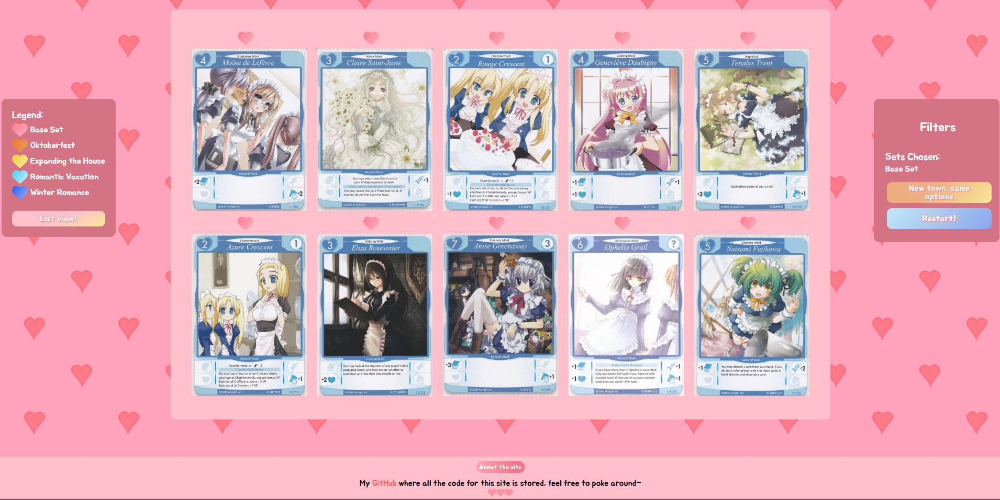
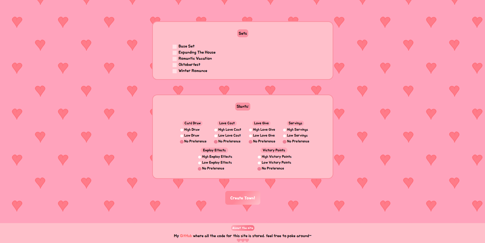
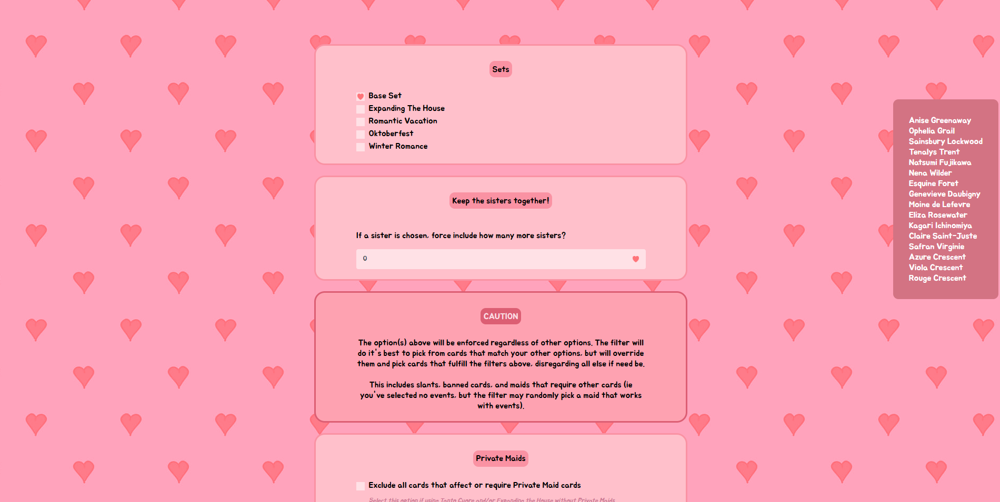
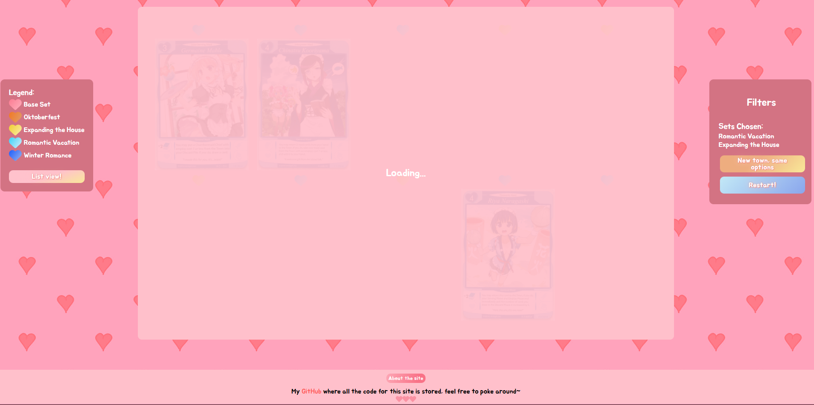
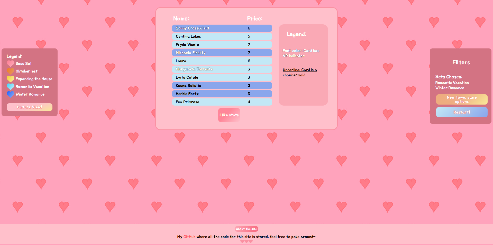
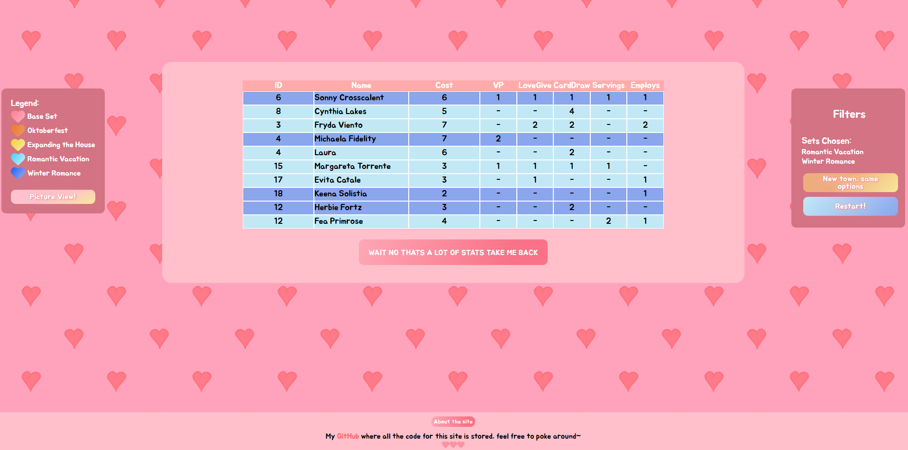

Built with Vite, React, TS, useReducer & useContext, react-icons, node, JSON blob database? react-transition-group

<!-- PROJECT LOGO -->
 

  

  <h3 align="center">Tanto Cuore Randomizer</h3>

  

    A randomizer with options for the game Tanto Cuore
     
    <a href="https://github.com/ArchangeLillith/knitters-fren"><strong>Explore the docs »</strong></a>
     
  

<!-- TABLE OF CONTENTS -->

  
Table of Contents

  <ul>
    <li>
      <a href="#about-the-project">About The Project</a>
      <ul>
        <li><a href="#built-with">Built With</a></li>
      </ul>
    </li>
    <li><a href="#deployment">Deployment</a></li>
    <li><a href="#usage">Usage</a></li>
    <li><a href="#roadmap">Roadmap</a></li>
    <li><a href="#gallery">Gallery</a></li>
    <li><a href="#license">License</a></li>
  </ul>

<!-- ABOUT THE PROJECT -->
## About The Project

Tanto Cuore is played with a combination of 10 cards (called a 'town') across five different sets. While there is another website that allows users to create a town, I felt like I wanted not only more control of the cards picked, but I didn't like that there were no images of the cards selected - so I made my own website! I took styling inspiriation from the other website, but other than that my website is completly my own creation. My friends and I have used this semi-random website many times and have had great fun with the sometimes silly selections!

(<a href="#readme-top">back to top</a>)

### Built With

[![React][React.js]][React-url]
[![nodejs][nodejs]][nodejs-url]
[![express][express]][express-url]
[![S3][S3]][S3-url]
[![cors][cors]][cors-url]
[![esbuild][esbuild]][esbuild-url]
[![vite][vite]][vite-url]

(<a href="#readme-top">back to top</a>)

Originally this project was made in Angular, but having more experiance in React I wanted to port it over and do more with it. While I had a lot of the project scaffolding, Angular is very different from React, so ultimetly the only things I ended up using were the list of options I had in the Angular version and the look of the site, both of which I couldn't copy paste. Further, I was challenged by the unique choices I made for the styling of the website. The highlight of my learning from this project was how to remove excess CSS, and how to code in a mindset that, from the beginning, leads to clean CSS. The created cards are mostly CSS, leveraging grid-template-areas and dynamic coloring that communicate which set the card is from. Original card images are displayed with a legend symbol above them to help the user search in the correct box. 

At first, I stylized everything using CSS specific to each individual property, leading to a very bloated CSS file. I found I had trouble figuring out where things were, and refactored the whole CSS and app to ensure that only the bare minimum CSS is used. This meant combining layout classes into one global class, and pulling colors into variable names that make the CSS much more readable. 

<!-- GETTING STARTED -->
## Deployment

   
   
  
  [![tanto-randomizer][tanto-randomizer]][tanto-randomizer-url]
  

(<a href="#readme-top">back to top</a>)

<!-- USAGE EXAMPLES -->
## Usage

To use this website, you'll need some idea of how the game Tanto cuore works. The different options are self explanitory when you've played the game, and I've attempted to make it as user friendly as possible. Set specific options don't appear until their set is chosen, and there's a button to just redo the randomization with the same parameters if the user doesn't like the town that was generated (this way they only select what they want once!). Plain and simple, select the desired options and hit create!

(<a href="#readme-top">back to top</a>)

<!-- ROADMAP -->
## Roadmap
- [x] Compile a JSON blob database of cards to read from (this was done with tanto-cuore-funnel, another project https://github.com/ArchangeLillith/tanto-cuore-funnel)
- [x] Determine what options should be allowed
- [x] Create the home page based on those options, as well as a final town page
- [x] Wire logic for the options
- [x] Build 'cards' from CSS to populate the final town 
- [x] Town generation algorithm creation 
- [x] Final styling pass 

(<a href="#readme-top">back to top</a>)

<!-- GALLERY -->
## Gallery
Explore Tanto Randomizer below through images!

  
Home View

 

  
Home with a Set Selected

 

  
Loading State

  

  
Town View

  

  
List View

  

  
Stats View

  

(<a href="#readme-top">back to top</a>)

<!-- LICENSE -->
## License

Distributed under the MIT License. See `LICENSE.txt` for more information.

(<a href="#readme-top">back to top</a>)

[React.js]: https://img.shields.io/badge/React-20232A?style=for-the-badge&logo=react&logoColor=61DAFB
[React-url]: https://reactjs.org/
[tanto-randomizer]: https://img.shields.io/badge/live_site!-ffc2c0?style=for-the-badge
[tanto-randomizer-url]: https://tanto-randomizer-fb8a3be947e5.herokuapp.com/
[vite]: https://img.shields.io/badge/vite-8A89FF?style=for-the-badge&logo=vite&logoColor=DAA520
[vite-url]: https://vite.dev/
[dayjs]: https://img.shields.io/badge/dayjs-FF6347?style=for-the-badge&logo=c&logoColor=fff
[dayjs-url]: https://day.js.org/
[esbuild]: https://img.shields.io/badge/esbuild-F4C430?style=for-the-badge&logo=esbuild&logoColor=000000
[esbuild-url]: https://esbuild.github.io/
[eslint]: https://img.shields.io/badge/eslint-A78BFA?style=for-the-badge&logo=eslint&logoColor=000000
[eslint-url]: https://eslint.org/
[cors]: https://img.shields.io/badge/CORS-E8A87C?style=for-the-badge&logo=express&logoColor=8B4000
[cors-url]: https://github.com/expressjs/cors
[js-cookie]: https://img.shields.io/badge/JS_Cookie-D2B48C?style=for-the-badge&logo=javascript&logoColor=8B4513
[js-cookie-url]: https://www.npmjs.com/package/js-cookie
[bcrypt]: https://img.shields.io/badge/bcrypt-90EE90?style=for-the-badge&logo=bloglovin&logoColor=2A9D8F
[bcrypt-url]: https://github.com/kelektiv/node.bcrypt.js
[Bootstrap.com]: https://img.shields.io/badge/Bootstrap-563D7C?style=for-the-badge&logo=bootstrap&logoColor=white
[Bootstrap-url]: https://getbootstrap.com
[nodejs]: https://img.shields.io/badge/node.js-d8e3db?style=for-the-badge&logo=nodedotjs&logoColor=#fffffff
[nodejs-url]: https://nodejs.org/en
[express]: https://img.shields.io/badge/express-c3c6c7?style=for-the-badge&logo=express&logoColor=##9ccce6
[express-url]:https://expressjs.com/
[Passport]: https://img.shields.io/badge/Passport-4e5052?style=for-the-badge&logo=passport&logoColor=#62e371
[Passport-url]: https://www.passportjs.org/
[JSON-web-tokens]:https://img.shields.io/badge/JSON_Web_Tokens-6fd1cb?style=for-the-badge&logo=jsonwebtokens&logoColor=#fffffff
[JSON-web-tokens-url]: https://jwt.io/
[MySQL]: https://img.shields.io/badge/MySQL-ffffff?style=for-the-badge&logo=mysql&logoColor=#fffffff
[MySQL-url]: https://www.mysql.com/
[S3]: https://img.shields.io/badge/Amazon_S3-e5e5e5?style=for-the-badge&logo=amazon-s3
[S3-url]: https://aws.amazon.com/pm/serv-s3/?gclid=EAIaIQobChMIzbHh-_XgiAMVci2tBh0TGjcJEAAYASAAEgL-KvD_BwE&trk=936e5692-d2c9-4e52-a837-088366a7ac3f&sc_channel=ps&ef_id=EAIaIQobChMIzbHh-_XgiAMVci2tBh0TGjcJEAAYASAAEgL-KvD_BwE:G:s&s_kwcid=AL!4422!3!536324434071!e!!g!!amazon%20s3!11346198420!112250793838
